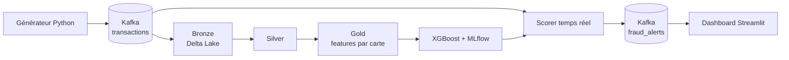

# Fraud Lakehouse

Plateforme de détection de fraude en temps réel (big data).

## Stack
Kafka (KRaft), Spark Structured Streaming, Delta Lake, Docker, Python 3.12

## Architecture

## Démarrage
docker compose up -d

## Avancement
- [x] Environnement, Git, Docker
- [x] Kafka
- [x] Générateur de transactions
- [x] Couche bronze (Kafka vers Delta Lake)
- [x] Couche silver (JSON décodé, typé, nettoyé)
- [x] Couche gold (features par carte)
- [x] Modèle ML (XGBoost + MLflow)
- [x] Scoring temps réel (topic fraud_alerts)
- [ ] Dashboard Streamlit

## Benchmarks

Machine : PC portable, 8 Go de RAM, Docker limité à 4 Go, 2 processeurs.

| Test | Résultat |
|---|---|
| Générateur, 500/s demandés | 500/s |
| Générateur, 5 000/s demandés | 4 946/s |
| Générateur, 20 000/s demandés | 4 341/s |
| Bronze, rattrapage de l'arriéré | environ 1 270 lignes/s |

Le générateur Python mono-processus plafonne à environ 4 300-5 000 événements/s.
Le goulot d'étranglement est le générateur, pas Kafka.

## Vérifications de qualité
- Bronze : 229 501 lignes, somme des offsets des 3 partitions identique à Kafka
  (aucune perte, aucun doublon).
- Silver : 229 500 lignes (le message de test sans `is_fraud` est écarté),
  dont 2 272 fraudes (0,99 %).

## Choix techniques
- 3 partitions, avec `card_id` comme clé de message : les transactions d'une même
  carte restent dans l'ordre.
- 1 % de fraude injectée, avec 5 % de voyages légitimes à l'étranger, pour que le
  pays seul ne suffise pas à détecter la fraude.
- Bronze = données brutes inchangées (JSON en texte), ce qui permet de tout rejouer.
- Silver = schéma explicite, types corrects, lignes invalides filtrées.
- Silver en `availableNow` : le job traite tout ce qui est disponible puis
  s'arrête, ce qui économise la RAM.
- Stockage Delta Lake dans un dossier local : MinIO n'est plus distribué sur
  Docker Hub, et la RAM est limitée.
- Les features gold n'utilisent que l'historique passé de la carte (les fenêtres excluent la ligne courante), pour éviter toute fuite de données.
- Limite connue : `tx_1h` n'a pas de pouvoir discriminant avec le générateur actuel (pas de fraudes en rafale). Les fraudes générées sont aussi trop faciles à détecter (montant x15, toujours à l'étranger) : on les rendra plus ambiguës.
## Modèle de détection (XGBoost)
- Découpage chronologique 80/20 : entraînement sur le passé (183 600 lignes, 1 814 fraudes), test sur le futur (45 900 lignes, 458 fraudes).
- `scale_pos_weight` (environ 100) pour compenser le déséquilibre, seuil de décision à 0,5.
- Résultats sur le test : précision 0,816, rappel 0,980, F1 0,891, PR-AUC 0,984.
- Environ 449 fraudes détectées sur 458, pour 101 fausses alertes sur 45 442 transactions normales.
- `is_foreign` porte 97,5 % de l'importance. Les fausses alertes viennent des voyages légitimes à l'étranger (5 % des transactions normales).
- Limite : données synthétiques faciles (fraudes toujours à l'étranger, montant x15). Les scores sont donc optimistes.
- Suivi des expériences avec MLflow (base SQLite locale).

## Scoring temps réel (phase 4)
- Un consumer Python lit le topic `transactions`, recalcule les features par carte (état en mémoire : somme, compteur, fenêtre d'une heure) et applique le modèle XGBoost.
- Les alertes sont publiées dans le topic `fraud_alerts`.
- Test à 500 événements/s pendant 30 s : 15 000 transactions, 149 fraudes détectées sur 149, 27 fausses alertes (précision environ 85 %).
- Latence moyenne de bout en bout : 598 ms, en hausse pendant le test (le scorer mono-processus suit à peine le débit).
- Les features sont calculées avant la mise à jour de l'état de la carte (pas de fuite de données).
- Limite : le scorer garde son état en mémoire. S'il redémarre, il perd l'historique des cartes (démarrage à froid).
## Dashboard (Streamlit)
Cinq onglets : temps réel, analyse, carte des fraudes, enquête par carte, état du pipeline. La barre latérale permet de filtrer les alertes et de démarrer le scorer et le générateur.

