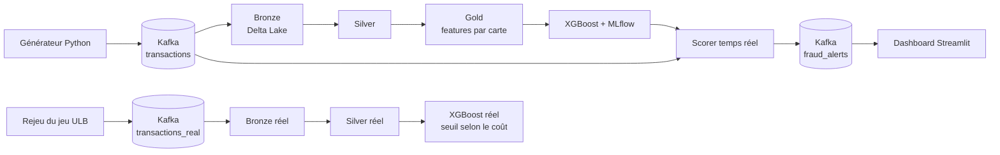
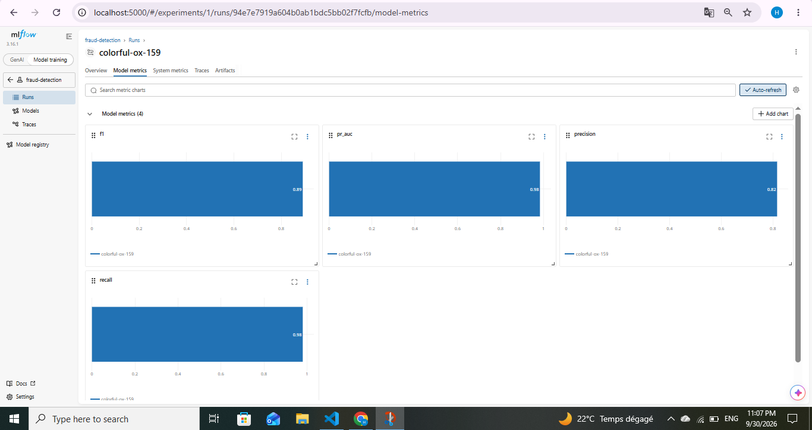
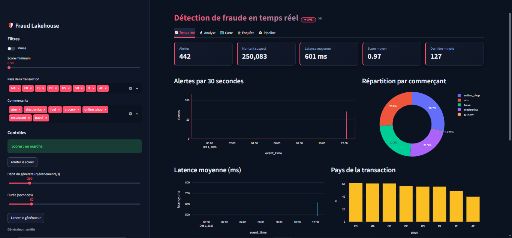
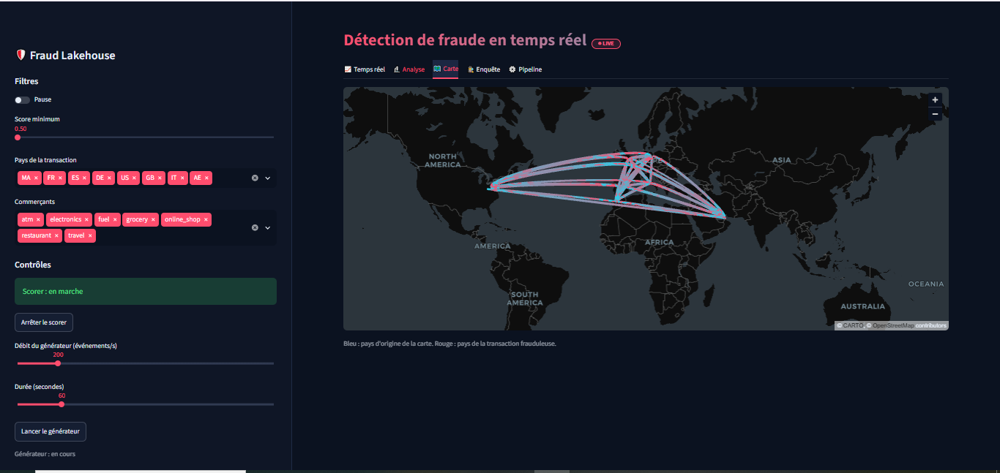

# Fraud Lakehouse

Plateforme de détection de fraude par carte bancaire en temps réel : ingestion en continu avec Kafka, lakehouse Delta Lake (bronze, silver, gold) traité par Spark, modèle XGBoost suivi avec MLflow, scoring en temps réel et dashboard Streamlit. Le pipeline a été construit sur un jeu synthétique, puis validé sur de vraies transactions anonymisées.

Tout tourne sur un PC portable de 8 Go de RAM (Docker limité à 4 Go).

## Stack
Kafka 3.8 (mode KRaft), Spark 3.5.3 Structured Streaming, Delta Lake 3.2, XGBoost, MLflow, Streamlit et Plotly, Docker, Python 3.12 (géré avec `uv`).

## Architecture


## Avancement
- [x] Environnement, Git, Docker
- [x] Kafka
- [x] Générateur de transactions
- [x] Couche bronze (Kafka vers Delta Lake)
- [x] Couche silver (JSON décodé, typé, nettoyé)
- [x] Couche gold (features par carte)
- [x] Modèle ML (XGBoost + MLflow)
- [x] Scoring temps réel (topic `fraud_alerts`)
- [x] Dashboard Streamlit
- [x] Validation sur données réelles (jeu ULB) : bronze, silver, modèle
- [x] Seuil de décision choisi selon le coût (`ml/cost_threshold.py`)

## Benchmarks

Machine : PC portable, 8 Go de RAM, Docker limité à 4 Go, 2 processeurs.

| Test | Résultat |
|---|---|
| Générateur, 500/s demandés | 500/s |
| Générateur, 5 000/s demandés | 4 946/s |
| Générateur, 20 000/s demandés | 4 341/s |
| Bronze, rattrapage de l'arriéré | environ 1 270 lignes/s |
| Rejeu du jeu réel (284 807 lignes) | 499/s, en 9 min 25 s |

Le générateur Python mono-processus plafonne à environ 4 300-5 000 événements/s.
Le goulot d'étranglement est le générateur, pas Kafka.

## Vérifications de qualité
- Bronze : 229 501 lignes, somme des offsets des 3 partitions identique à Kafka
  (aucune perte, aucun doublon).
- Silver : 229 500 lignes (le message de test sans `is_fraud` est écarté),
  dont 2 272 fraudes (0,99 %).

## Choix techniques
- 3 partitions, avec `card_id` comme clé de message : les transactions d'une même
  carte restent dans l'ordre, ce qui rend possible l'état par carte du scorer.
- 1 % de fraude injectée, avec 5 % de voyages légitimes à l'étranger, pour que le
  pays seul ne suffise pas à détecter la fraude.
- Bronze = données brutes inchangées (JSON en texte), ce qui permet de tout rejouer.
- Silver = schéma explicite, types corrects, lignes invalides filtrées.
- Silver et les jobs de rejeu en `availableNow` : le job traite tout ce qui est
  disponible puis s'arrête, ce qui économise la RAM.
- Stockage Delta Lake dans un dossier local : MinIO n'est plus distribué sur
  Docker Hub, et la RAM est limitée.
- Les features gold n'utilisent que l'historique passé de la carte (les fenêtres
  excluent la ligne courante), pour éviter toute fuite de données.
- Découpages toujours chronologiques (entraînement sur le passé, test sur le futur).

## Modèle de détection (XGBoost, données synthétiques)
- Découpage chronologique 80/20 : entraînement sur le passé (183 600 lignes, 1 814 fraudes), test sur le futur (45 900 lignes, 458 fraudes).
- `scale_pos_weight` (environ 100) pour compenser le déséquilibre, seuil de décision à 0,5.
- Résultats sur le test : précision 0,816, rappel 0,980, F1 0,891, PR-AUC 0,984.
- Environ 449 fraudes détectées sur 458, pour 101 fausses alertes sur 45 442 transactions normales.
- `is_foreign` porte 97,5 % de l'importance. Les fausses alertes viennent des voyages légitimes à l'étranger (5 % des transactions normales).
- Suivi des expériences avec MLflow (base SQLite locale).



## Scoring temps réel
- Un consumer Python lit le topic `transactions`, recalcule les features par carte (état en mémoire : somme, compteur, fenêtre d'une heure) et applique le modèle XGBoost.
- Les alertes sont publiées dans le topic `fraud_alerts`.
- Test à 500 événements/s pendant 30 s : 15 000 transactions, 149 fraudes détectées sur 149, 27 fausses alertes (précision environ 85 %).
- Latence moyenne de bout en bout : 598 ms, en hausse pendant le test (le scorer mono-processus suit à peine le débit).
- Les features sont calculées avant la mise à jour de l'état de la carte (pas de fuite de données).

## Dashboard (Streamlit)
Cinq onglets : temps réel, analyse, carte des fraudes, enquête par carte, état du pipeline. La barre latérale permet de filtrer les alertes et de démarrer le scorer et le générateur.




## Validation sur données réelles (jeu ULB)
- Source : « Credit Card Fraud Detection », Worldline et Machine Learning Group de l'ULB (284 807 transactions de cartes européennes sur deux jours, 492 fraudes, soit 0,172 %). Cité : Dal Pozzolo, Caelen, Johnson, Bontempi, « Calibrating Probability with Undersampling for Unbalanced Classification », IEEE CIDM 2015. Récupéré via OpenML (identifiant 1597).
- Le fichier est rejoué dans Kafka (topic `transactions_real`, 499 lignes/s, 9 min 25 s pour tout le fichier), puis bronze (284 807 lignes), silver (284 807 lignes, 492 fraudes) et entraînement.
- La colonne `Time` n'est pas fournie par OpenML : l'ordre des lignes, qui est l'ordre chronologique du fichier original (vérifié sur les premiers montants : 149,62, 2,69, 378,66), sert de temps.
- Découpage chronologique 80/20 : 227 845 lignes (417 fraudes) pour l'entraînement, 56 962 (75 fraudes) pour le test.
- Résultats sur le test, seuil 0,5 : précision 0,79, rappel 0,76, F1 0,78. Sur 75 fraudes, 57 sont détectées, 18 manquées, et il y a 15 fausses alertes sur 56 887 transactions normales.
- Variables les plus importantes : V14 (34 %), V10 (13 %), V4 (7 %).
- Contrairement au jeu synthétique (rappel 0,98), les fraudes réelles ne suivent aucune règle simple : c'est ce chiffre qui est représentatif.

| Seuil | Précision | Rappel | Alertes |
|---|---|---|---|
| 0,1 | 0,448 | 0,800 | 134 |
| 0,3 | 0,679 | 0,760 | 84 |
| 0,5 | 0,792 | 0,760 | 72 |
| 0,7 | 0,836 | 0,747 | 67 |
| 0,9 | 0,902 | 0,733 | 61 |

Précautions :
- Le test ne contient que 75 fraudes : une fraude de plus ou de moins déplace le rappel d'environ 1,3 point. Les chiffres sont indicatifs.
- Ce tableau est calculé sur le test : il montre le compromis précision / rappel, mais ne doit pas servir à choisir le seuil (le seuil se choisit sur un jeu de validation séparé).

## Seuil de décision selon le coût (données réelles)
- Modèle réentraîné sur 60 % des lignes (170 884 lignes, 360 fraudes), seuil choisi sur 20 % de validation (56 961 lignes, 57 fraudes), évalué sur 20 % de test (56 962 lignes, 75 fraudes), toujours dans l'ordre chronologique.
- Coût supposé : une fraude manquée coûte son montant, une alerte coûte 5 euros (vérification).
- Résultats sur le test :

| Stratégie | Coût | Précision | Rappel | Alertes |
|---|---|---|---|---|
| Aucun modèle | 7 729 euros | n/a | n/a | 0 |
| Seuil 0,5 | 2 978 euros | 0,838 | 0,760 | 68 |
| Seuil optimal 0,04 (choisi sur la validation) | 3 275 euros | 0,341 | 0,813 | 179 |

- Le modèle réduit le coût de 61 % par rapport à l'absence de modèle (seuil 0,5).
- Le seuil optimisé sur la validation (0,04) fait moins bien sur le test que le seuil 0,5 : avec seulement 57 fraudes en validation, le seuil optimal n'est pas stable. Conclusion : sur si peu de fraudes, le seuil par défaut est plus fiable qu'un seuil optimisé. Une validation croisée ou un jeu plus grand serait nécessaire pour affiner ce choix.
- Le coût de 5 euros par alerte est une hypothèse : le seuil optimal dépend directement de ce paramètre.

## Limites
- Les données synthétiques sont faciles (fraudes toujours à l'étranger, montant environ 15 fois supérieur) : les scores sont optimistes.
- `tx_1h` n'a aucun pouvoir discriminant avec le générateur actuel (pas de fraudes en rafale).
- Les cartes sont recréées à chaque lancement du générateur : les premières transactions n'ont pas d'historique (démarrage à froid), ce qui produit des fausses alertes.
- Le scorer est un processus unique, avec l'état des cartes en mémoire : il suit à peine 500 événements/s et perd son historique s'il redémarre.
- Le jeu réel est anonymisé (pas de pays, de commerçant ni de carte) : les features par carte et le dashboard par pays ne s'y appliquent pas.
- Seulement 75 fraudes dans le test réel : résultats indicatifs.
- Le choix du seuil selon le coût est instable : la validation ne contient que 57 fraudes.
- Le scorer temps réel et le dashboard utilisent le modèle entraîné sur les données synthétiques, pas celui des données réelles.

## Reproduire le projet

Prérequis : Docker Desktop (4 Go alloués), Python 3.12, `uv`.

```
uv venv --python 3.12
.venv\Scripts\activate
uv pip install confluent-kafka pandas scikit-learn xgboost mlflow deltalake streamlit plotly
docker compose up -d kafka
docker exec kafka /opt/kafka/bin/kafka-topics.sh --bootstrap-server localhost:9092 --create --topic transactions --partitions 3 --replication-factor 1
docker exec kafka /opt/kafka/bin/kafka-topics.sh --bootstrap-server localhost:9092 --create --topic fraud_alerts --partitions 3 --replication-factor 1
docker exec kafka /opt/kafka/bin/kafka-topics.sh --bootstrap-server localhost:9092 --create --topic transactions_real --partitions 3 --replication-factor 1
```

Pipeline synthétique :
1. `python generator/producer.py --rate 500 --duration 60` génère des transactions.
2. `streaming/bronze.py`, `silver.py` et `gold.py` se lancent avec `spark-submit` dans l'image `apache/spark:3.5.3` (dossier du projet monté dans le conteneur, `--packages io.delta:delta-spark_2.12:3.2.0`, et `org.apache.spark:spark-sql-kafka-0-10_2.12:3.5.3` pour bronze).
3. `python ml/train.py` entraîne le modèle (suivi MLflow dans `mlflow.db`).
4. `python ml/score_stream.py` lance le scorer.
5. `streamlit run dashboard/app.py` lance le dashboard.

Pipeline réel :
1. `python ml/download_ulb.py` télécharge le jeu depuis OpenML.
2. `python generator/replay_ulb.py --rate 500` le rejoue dans Kafka.
3. `streaming/bronze_real.py` puis `silver_real.py` (même méthode que ci-dessus).
4. `python ml/train_real.py`, puis `python ml/cost_threshold.py`.